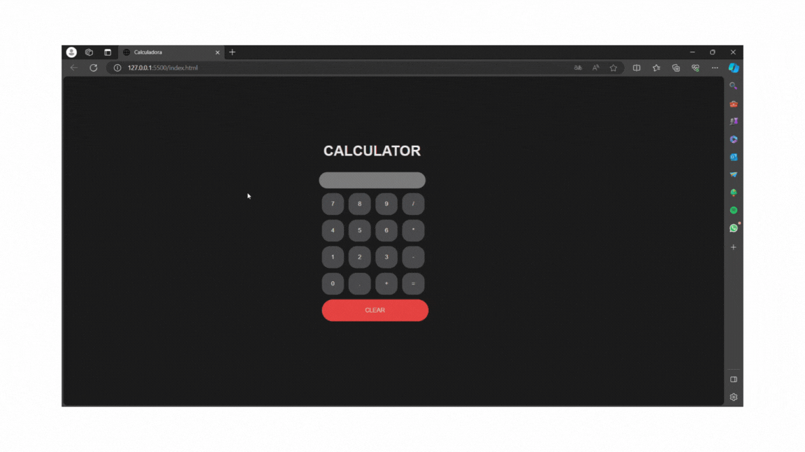

<h1 align="center">Calculadora</h1>

<h5 align= "center">( calculator-weld-delta.vercel.app )</h5>

<h2 align="center">
    Projeto de uma calculadora utilizando as linguagens de marcação HTML e CSS, e a linguagem de programação Javascript.
    O usuário deve escolher os números para realizar as operações desejadas, para executar os cálculos deve-se clicar no botão '=', caso queira limpar todas as operações, deve-se apertar o botão 'clear'
</h2>

<h2 align="center"> 
	Concluído 🟢
</h2>

<h2> 
	Demonstração do projeto
</h2>

<h2> 
	 🛠 Tecnologias
</h2>

As seguintes ferramentas foram usadas na construção do projeto:

- HTML
- CSS
- Javascript

## 👩🏻 Autora

Feito por Laís Martelini 👋 [Entre em contato!](https://www.linkedin.com/in/laís-martelini/)
